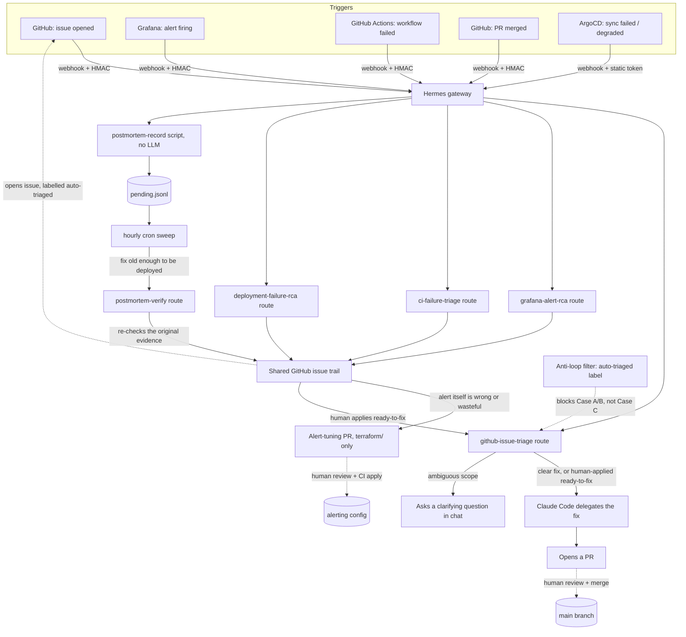

# hermes-recipes

Working recipes for running a [Hermes](https://hermes-agent.nousresearch.com) agent gateway
as unattended, on-call infrastructure: triaging GitHub issues, doing root-cause analysis on
Grafana alerts, and proposing fixes as reviewable pull requests — instead of paging a human
at 3am for something an agent can investigate first.

This is not a Hermes fork and not a product. It is the configuration, prompts, and glue code
from a real deployment, genericized into templates you can drop into your own project. Every
value that was specific to one deployment (repo name, Discord channel, Grafana stack, tunnel
domain, IPs) has been replaced with a placeholder — see [Setup](#setup).

## How it fits together

Every route shares the same gateway and the same rules: a dedicated bot identity, a
path-scoped write boundary, and a human on the merge button. See
[`docs/security-model.md`](docs/security-model.md) for the reasoning behind each arrow above.

Two loops are worth reading carefully. First, at the bottom: an issue Hermes opens from an RCA
is itself a GitHub issue, so it fires the exact same `issues` webhook a human-filed one would —
the `auto-triaged` label and the filter it triggers are the only thing standing between "an
alert fired" and "an agent starts pushing commits in response to its own report." Second, in
the middle: a human applying the `ready-to-fix` label is the one deliberate, supervised way
that same guard gets crossed — see `recipes/github-issue-triage/README.md`'s Case C.

## What's in here

| Path | What it is |
| --- | --- |
| `recipes/github-issue-triage/` | On a new GitHub issue, delegates a clear fix to Claude Code and opens a PR, or asks a clarifying question and stops. Also handles the `ready-to-fix` human hand-off from the RCA recipes below |
| `recipes/grafana-alert-rca/` | On a firing Grafana alert, does root-cause analysis (not just "restart the pod") and maintains a GitHub issue trail — plus the Terraform module that manages the alert rules themselves |
| `recipes/ci-failure-triage/` | On a failed GitHub Actions run, tells a flaky failure from a real regression and maintains the same issue trail; its only write path is a narrowly-scoped PR against your CI config itself |
| `recipes/deployment-failure-rca/` | On an ArgoCD sync failure or health degradation, works out whether the just-deployed revision caused it, exposed something pre-existing, or is unrelated infra flake |
| `recipes/postmortem-verification/` | On a merged PR that closes an RCA issue, waits for the deploy window, re-checks the original evidence, and closes the loop with a verified postmortem or a reopened issue |
| `scripts/` | Read-only Loki query helpers the agent uses to pull logs and stack traces during an investigation |
| `provisioning/` | An Ansible playbook that provisions a small always-on box (a spare machine, a cheap VPS) with Hermes, Claude Code, and the systemd units to run them |
| `systemd/` | A unit file for exposing the gateway's webhook port through a stable tunnel (ngrok) if you don't want to open a port on your router |
| `docs/security-model.md` | The trust model this is built on — read this before running any of it |
| `docs/lessons-learned.md` | Two real bugs a live run of this exact setup caught in itself, worth knowing before you hit them too |
| `docs/optional-tools.md` | Where to plug in a dedicated Kubernetes-diagnostics tool instead of extending these recipes to do it worse |

## Why this shape, not "just prompts"

An agent that can read your logs, clone your repo, and open pull requests unattended is only
as safe as its blast radius. Every recipe here follows the same rules:

- **A dedicated bot GitHub identity**, not your personal token. It can push branches and open
  PRs; it never merges and never pushes to `main` directly.
- **Path-scoped write access.** The alert-tuning recipe, for example, is only allowed to touch
  files under one directory (`terraform/grafana/` in the example); anything else is refused
  by the prompt and reviewed away in the PR.
- **A human merges everything.** CI plans and comments; a person approves. The agent's job
  ends at "here's a reviewable PR", not "here's what I already deployed".
- **Every clone is unique and disposable.** Two alerts firing at once must not race on the
  same checkout — see `docs/lessons-learned.md` for what happens when that's not true.
- **A quiet failure mode.** When the agent isn't confident, it asks a question in chat and
  stops, rather than guessing on your production repo.
- **Write scope matches investigation depth.** The two recipes that touch application code
  (`github-issue-triage`'s Case A/C) require either an unambiguous request or an explicit human
  label; the three RCA recipes never touch application code at all, only ever a GitHub issue
  and, in two cases, a narrowly path-scoped PR against their own configuration.
- **State that outlives one webhook delivery lives in a file, not the agent's head.**
  `postmortem-verification` doesn't ask an agent to "wait a day" inside a single run — it
  records intent mechanically (no LLM call) and lets a cron job wake the real investigation
  once a deploy window has actually elapsed.

None of this makes an unattended agent risk-free. It makes the risk legible and bounded, which
is the bar to clear before you point one at anything that matters.

## Setup

1. **Install Hermes** on a small always-on box using `provisioning/playbook.yml` (Ansible), or
   by hand following the [Hermes docs](https://hermes-agent.nousresearch.com) — the playbook
   is optional, everything else here just needs a running Hermes gateway.
2. **Pick a recipe** and read its README. Each one lists the placeholders you need to replace:
   `<YOUR_ORG>/<YOUR_REPO>`, `<YOUR_DISCORD_CHANNEL>`, `<YOUR_GRAFANA_STACK>`, etc.
3. **Generate a secret per route**: `openssl rand -hex 32`. Never reuse one secret across
   routes or share it between the webhook sender's config and anywhere public.
4. **Wire the webhook sender** (GitHub, Grafana, ArgoCD) to POST to your gateway with that
   secret. Hermes dispatches by URL path (`/webhooks/<route-name>`), not by inspecting the
   payload, so each recipe needs its **own** webhook subscription pointed at its own route
   path — you can have several GitHub webhooks on the same repo side by side, one per recipe,
   each with its own secret and its own selected events. If your gateway isn't reachable from
   the internet, `systemd/ngrok-tunnel.service.example` shows one way to expose it through a
   stable, free-tier domain.
5. Read `docs/security-model.md` before turning any route loose on a repo you care about.

## What you'll need to bring yourself

This repo has no CI, no tests, and isn't meant to be depended on as a library — copy what you
need and adapt it. You'll need: a Hermes install, a GitHub repo with a bot account that has
push access, and (for the Grafana and postmortem-verification recipes) a Grafana Cloud stack or
self-hosted instance with Loki. `postmortem-verification` also needs `flock` (standard on
Debian/Ubuntu, not on macOS) and an OS cron. `deployment-failure-rca` needs ArgoCD with its
notifications controller running. Everything is plain YAML/Python/Bash/Terraform; there's
nothing to `npm install`.

## License

MIT, see `LICENSE`. Hermes itself is a separate project — this repo only configures it.
