# hermes-recipes

A durable AI-assisted software-development lifecycle plus operational recipes for [Hermes](https://hermes-agent.nousresearch.com). The lifecycle turns approved intent into a checked branch/PR, handles review revisions, and verifies the deployed revision. Humans approve specifications, review/merge code, and deploy. Agents never merge or deploy autonomously.

## Lifecycle

```mermaid
flowchart LR
    I[Issue / feature / maintenance / migration] --> Q[Authenticated durable inbox]
    Q --> P[Tool-free Hermes plan]
    P --> A[Human approves specification hash]
    A --> C[Tool-free code proposal]
    C --> V[Isolated Docker checks]
    V --> R[Independent proposal review]
    R --> PR[Branch / optional bot PR]
    PR --> H[Human review and merge]
    PR -->|bounded revision| C
    H --> D[Deployment SHA + environment]
    D --> O[Observation window + live evidence]
    O --> E[Verified outcome / needs human]
```



The controller—not model text—owns approval, write scope, checks, Git, publication, retry limits and durable state. Model calls use the installed Hermes provider pool with zero tools, project context/memory disabled, and plugin discovery disabled in a separate process. Checks execute in credential-free, network-disabled Docker containers on disposable copies. See [security](docs/security-model.md) before activation.

## What's included

| Path | Purpose |
| --- | --- |
| `hermes_sdlc/` | Python control plane: SQLite inbox/leases/approvals/evidence, model bridge, sandbox, authenticated background receiver and typed production verification |
| `scripts/install-sdlc.py` | Installs private local configuration/secrets, Hermes skill and Python service definition; no command launcher |
| `provisioning/github.json`, `scripts/provision-github.py` | Declarative GitHub labels, webhook, review/check ruleset and Actions token policy; administrator-only plan/apply |
| `tests/test_lifecycle.py` | Deterministic regression/evaluation scenarios for authorization/state/path/ingress boundaries |
| `docs/ai-sdlc/` | Full enterprise research, 23-source manifest, historical gap analysis, architecture, operating instructions and executed lifecycle evidence |
| `recipes/grafana-alert-rca/` | Existing Grafana investigation prompts and Terraform alert examples |
| `recipes/ci-failure-triage/` | Existing CI investigation and narrowly scoped CI-tuning prompts |
| `recipes/deployment-failure-rca/` | Existing ArgoCD deployment-failure investigation prompts |
| `provisioning/` | Optional Linux gateway and lifecycle installation |

The three RCA recipes are prompt-guided investigations; they do **not** gain the control plane's sandbox/approval guarantees merely by sharing this repository. They create an issue trail. A human's `ready-to-fix` label starts lifecycle planning, not permission to implement. A separate specification approval is required.

## Local setup

Python 3.11+, installed/authenticated Hermes, GitHub CLI, Git and a working Docker daemon are required. The package itself has no pip dependencies; inference runs with the installed Hermes virtualenv.

```bash
docker pull python:3.12-slim
python3 scripts/install-sdlc.py --project YOUR_ORG/YOUR_REPO --source /absolute/checkout --approver YOUR_GITHUB_LOGIN
```

The installer defaults to **publication disabled** and the checks/path scope for this recipes repository. Configure the target project's trusted image, exact check commands, path allowlist, bot identity and production checks before using it for another application. It never copies credentials to an agent/check workspace or enables GitHub writes automatically.

GitHub infrastructure is also managed as code. Ask Hermes to provision it from `provisioning/github.json`; the administrator script previews changes by default and applies them with `--apply`. It preserves existing labels and unrelated hooks/rulesets, never prints the webhook secret, and leaves restrictions staged until activation prerequisites exist. See [code-managed GitHub setup](docs/ai-sdlc/operations.md#code-managed-github-setup). This is installation automation, not a replacement lifecycle CLI.

Ask Hermes to plan a feature, bug fix, maintenance task or migration: its skill uses built-in terminal `gh issue create/view/comment` and `gh pr view`. GitHub is the shared plan/status/review surface. Humans post `/sdlc approve RUN HASH`, `/sdlc status RUN`, `/sdlc cancel RUN` or `/sdlc recover RUN plan|revise|verify` on the matching issue/PR; Hermes never approves, merges or deploys for them. [Operating instructions](docs/ai-sdlc/operations.md) cover setup, feedback and event contracts.

The SDLC receiver defaults to `127.0.0.1:8645`, separate from the existing Hermes gateway. GitHub sends one authenticated subscription covering the lifecycle events to `/webhooks/github`. Each legacy RCA recipe still uses its own gateway endpoint and secret. Use TLS termination for public exposure; never expose an unauthenticated listener.

The installed background service retains the supervisor name `hermes-sdlc`; this is not an executable. Administrators launch the absolute checkout path `hermes_sdlc/service.py` using system Python, without arguments, through a process manager. There is no user command CLI or package main entrypoint.

## Cutover from the earlier issue/postmortem recipes

The old prompt-to-shell issue fixer and JSONL/cron postmortem installers have been removed. The inspected installed Hermes gateway did not support their assumed `script` dispatch property. Remove their existing gateway routes (`github-issue-triage`, `postmortem-record`, `postmortem-verify`), old webhook subscriptions and verification cron before switching over. Preserve old pending/processed files as audit evidence; HTTP acceptance is not evidence of completed verification. Re-submit unfinished work through the lifecycle after reviewing it. Do not enable both old application-writing routes and the new control plane.

## Verification

```bash
python3 -m unittest discover -s tests -v
```

The [historical pre-cutover lifecycle example](docs/ai-sdlc/lifecycle-example.md) preserves actual model/sandbox/local deployment evidence, not live proof of the GitHub-only workflow. Maintainers use the Python evaluation library for real-model evaluation; there is no evaluation command. Offline scenarios do not measure model quality. Kira's App authentication, public webhook delivery, remote CI and publication configuration are installed; see [current activation evidence and operating limits](docs/ai-sdlc/operations.md#applied-repository-evidence). Human plan approval and PR merge remain mandatory.

## License

MIT. Hermes remains a separate project; this repository configures and integrates its installed runtime.
