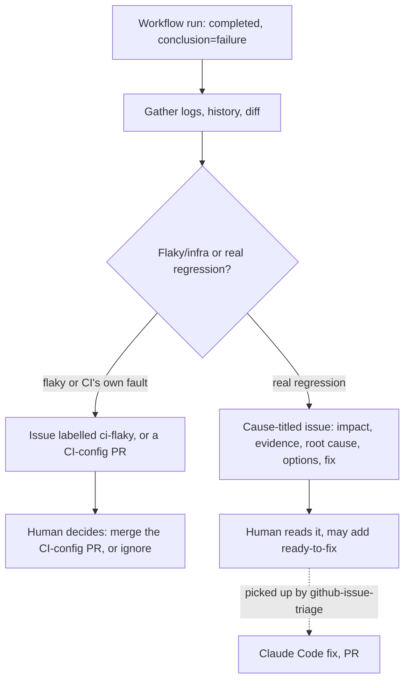

# Recipe: CI failure triage

A Hermes webhook route that fires when a GitHub Actions workflow run fails, tells a flaky/CI
failure apart from a real regression, and maintains the same GitHub issue trail as
`recipes/grafana-alert-rca` — but never opens a PR against application code. Its only write
path is a narrowly scoped PR against your CI configuration itself, for when CI is the thing
that's actually broken.

## How it decides



## Prerequisites

Same as `../grafana-alert-rca/`: a running Hermes gateway, a dedicated bot GitHub account with
push access (for the CI-config-tuning PR path only), and branch protection requiring review.

## Setup

1. Generate a secret: `openssl rand -hex 32`.
2. On the gateway box:
   ```bash
   export GITHUB_REPO=<your-org>/<your-repo>
   export DISCORD_CHANNEL=<your-discord-channel>
   export CI_WORKFLOWS_DIR=.github/workflows   # where the tuning PR is allowed to write
   HERMES_CI_ROUTE_SECRET=<the secret from step 1> python3 configure-route.py
   sudo systemctl restart hermes-gateway
   ```
3. On GitHub: repo Settings → Webhooks → Add webhook. Hermes dispatches by URL path, not by
   inspecting the payload, so this needs its own webhook subscription even if you already run
   `../github-issue-triage/` or `../grafana-alert-rca/` on the same repo — they each point at a
   different path with a different secret.
   - Payload URL: your gateway's public URL + `/webhooks/ci-failure-triage`
   - Content type: `application/json`, Secret: the value from step 1
   - Events: "Workflow runs"
4. Add the `ci-flaky` label to your repo if it doesn't exist: `gh label create ci-flaky`.
5. Push a commit that deliberately fails a cheap workflow (or wait for a real one) and confirm
   you see the announcement, the evidence gathering, and an issue or comment.

## Why this recipe doesn't write application code

CI failures are noisy and frequent compared to production alerts — an agent with write access
to application code on every red build is a much bigger blast radius than one on the rarer
event of a firing alert. Keeping this recipe RCA-and-issue-only, and routing "yes, actually fix
it" through a human adding the `ready-to-fix` label (see `../github-issue-triage/`), means the
decision to let an agent touch application code always passes through a human first, no matter
which recipe found the problem.

## Tuning

- **Flaky vs. regression heuristics.** The prompt's own judgment call here is the main thing
  worth iterating on. If your test suite has known-flaky patterns (a specific timeout, a
  specific external service), name them explicitly in the prompt so the agent doesn't have to
  rediscover them each time.
- **Anti-loop guard.** The route filters out any run whose branch starts with `ci-tuning/` —
  the prefix this recipe's own PRs use — so a fix to CI config doesn't trigger another
  investigation of itself if that PR's own CI run happens to fail.
- **Multiple workflows.** If you only want this recipe watching specific workflows (skip
  scheduled maintenance jobs, dependency-audit runs, etc.), add a filter on
  `workflow_run.name` or `workflow_run.path`.
