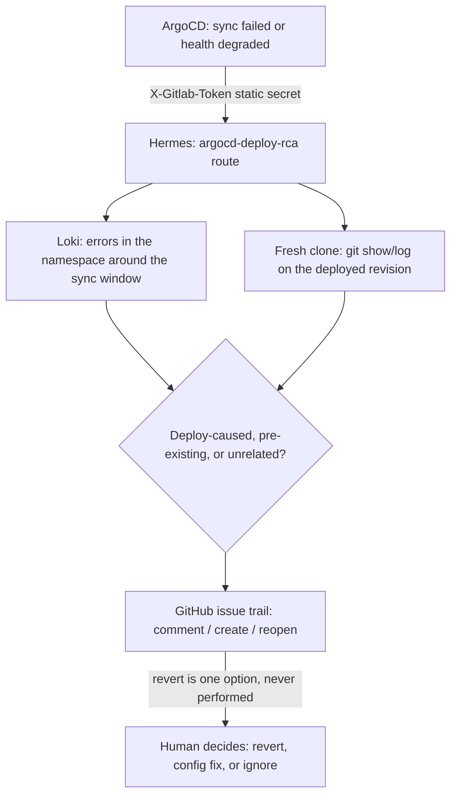

# Recipe: deployment-failure RCA (ArgoCD)

A Hermes route triggered by ArgoCD Notifications on a sync failure or health degradation,
investigating whether the revision that was just deployed caused it, merely exposed a
pre-existing weakness, or is unrelated infrastructure flake. RCA-only, like
`../ci-failure-triage`: no application-code writes, and it never performs a rollback itself —
only ever recommends one, as text, in the issue it opens.

This catches failures the log-based `../grafana-alert-rca` recipe cannot: a sync that fails
before the application ever starts (an invalid manifest, a Kustomize overlay error) produces
no application error log at all.

## How it investigates



## Prerequisites

- ArgoCD with the notifications controller running (standard in the `argo-cd` Helm chart).
- **Your Applications are almost certainly GitOps-managed with `selfHeal: true`.** That means
  a live `kubectl edit` of the Application's annotations will be reverted on the next
  reconciliation — the subscribe annotations in
  `argocd-notifications-patch.yaml.example` have to go into the Application's manifest in your
  Git repo, not applied by hand. The ConfigMap/Secret data keys are safer to merge live if
  ArgoCD itself isn't Terraform-managed, but see the note at the top of that file if it is.
- The Loki query helper installed (`../../scripts/loki-query.sh`), same as `../grafana-alert-rca`.

## Setup

1. Generate a secret: `openssl rand -hex 32`. This is the ONE shared secret for this route —
   see the authentication note below for why it's a static token, not a true HMAC signature.
2. On the gateway box:
   ```bash
   export GITHUB_REPO=<your-org>/<your-repo>
   export DISCORD_CHANNEL=<your-discord-channel>
   export NAMESPACE=<your-k8s-namespace>
   HERMES_ARGOCD_ROUTE_SECRET=<the secret from step 1> python3 configure-route.py
   sudo systemctl restart hermes-gateway
   ```
3. Merge `argocd-notifications-patch.yaml.example` into your cluster's ArgoCD Notifications
   config and your Application's annotations, using the same secret value from step 1 as
   `hermes-deploy-rca-token`. Read the file's own header comments first — how you apply it
   depends on how ArgoCD itself is managed in your cluster.
4. Test without waiting for a real outage: hand-craft the exact JSON the template would send
   and POST it yourself, signed the same way ArgoCD would sign it:
   ```bash
   SECRET=<the secret from step 1>
   BODY='{"type":"argocd-deploy-rca","reason":"sync-failed","app":"test-app","namespace":"<your-namespace>","phase":"Failed","syncStatus":"OutOfSync","healthStatus":"Missing","revision":"HEAD","message":"synthetic test","startedAt":"2026-01-01T00:00:00Z","finishedAt":"2026-01-01T00:00:05Z"}'
   curl -X POST https://<your-domain>/webhooks/argocd-deploy-rca \
     -H "Content-Type: application/json" -H "X-Gitlab-Token: $SECRET" -d "$BODY"
   ```
   Confirm you see the announcement and an investigation start, without needing to actually
   break a real deployment to prove the wiring works.

## Authentication note (read this)

ArgoCD Notifications' webhook service sends a plain HTTP request with templated headers and
body — it does not compute a signature of the body itself using a shared secret the way
GitHub, GitLab, and Grafana all do. So a true HMAC check on this route isn't something ArgoCD
can satisfy. This recipe instead reuses Hermes' GitLab-compatible signature scheme, which is
actually just a static-token comparison (`X-Gitlab-Token: <secret>`, checked with a
constant-time equality, no digest) — which is exactly what ArgoCD *can* send via a header
sourced from its own Secret. This is a real authentication factor, just a slightly weaker one
than a body HMAC: a captured token replays until you rotate it, where a captured HMAC signature
does not extend that risk to the secret itself. Treat this route's secret with the same care
as the others, and rotate it if you ever suspect it leaked (e.g. into cluster logs at debug
verbosity, which ArgoCD's webhook client can produce — check your log level).

## Tuning

- **`oncePer` on the sync-failed trigger** is set to the operation's start time, so ArgoCD's
  own retry/backoff doesn't send you (and Hermes) five notifications for one failed sync.
- **Namespace scope.** `NAMESPACE` here is one namespace; for multiple apps/namespaces, either
  run one route per namespace (different `app`/`namespace` values arrive in the payload
  regardless, so a single route already generalizes) or subscribe every Application you care
  about to the same two triggers — the route already reads `{app}`/`{namespace}` from the
  payload rather than assuming a fixed value.
- **Revert recommendations.** The prompt is told to weigh a revert as one option among several
  and to name its cost (losing whatever else was in that commit) — tune this language if your
  team's actual practice differs (e.g. you always revert first and investigate after; that's a
  legitimate but different risk posture than this recipe assumes).
