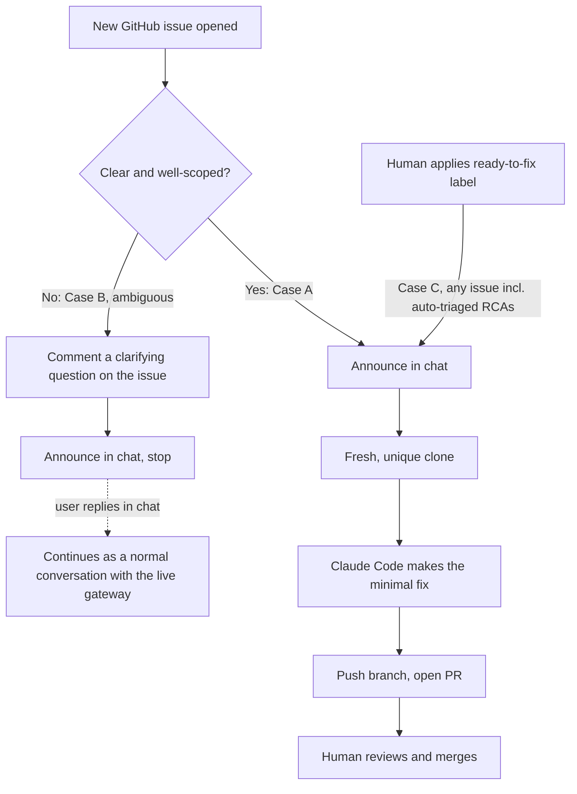

# Recipe: GitHub issue triage

A Hermes webhook route that fires on every newly opened GitHub issue and either delegates a
clear, small fix to Claude Code and opens a PR, or asks a clarifying question in chat and
stops. It never guesses on an ambiguous request, and it never pushes to `main`.

It also fires on one more event: a human applying a `ready-to-fix` label to any issue —
including one that `../grafana-alert-rca` or `../ci-failure-triage` opened from its own RCA.
That label is the supervised handoff from "an agent found and wrote up a root cause" to "an
agent is now allowed to write the fix" — see [How it decides](#how-it-decides) below.

## How it decides



## Prerequisites

- A running Hermes gateway (see `../../provisioning/`) reachable from GitHub, directly or
  through a tunnel (see `../../systemd/ngrok-tunnel.service.example`).
- A dedicated bot GitHub account, logged in on the gateway box (`gh auth login`), with push
  access to the target repo and **no** admin/bypass rights. See `../../docs/security-model.md`.
- Claude Code CLI installed on the gateway box (the Ansible playbook does this).
- Branch protection on the target repo requiring review before merge — this recipe opens PRs,
  it does not merge them, but that guarantee is only as good as your branch protection rule.
- The `ready-to-fix` label created on the repo: `gh label create ready-to-fix`.

## Setup

1. Generate a secret: `openssl rand -hex 32`.
2. On the gateway box:
   ```bash
   export GITHUB_REPO=<your-org>/<your-repo>
   export DISCORD_CHANNEL=<your-discord-channel>   # or adapt hermes send --to for another platform
   HERMES_GITHUB_ROUTE_SECRET=<the secret from step 1> python3 configure-route.py
   sudo systemctl restart hermes-gateway
   ```
3. On GitHub: repo Settings → Webhooks → Add webhook (or add the "Issues" event to an existing
   one shared with another recipe — see `../ci-failure-triage/README.md` for why one webhook
   can serve several recipes).
   - Payload URL: your gateway's public URL + `/webhooks/github-issue-triage`
   - Content type: `application/json`
   - Secret: the same value from step 1
   - Events: "Issues" only (GitHub delivers every action — opened, labeled, closed, ... — for
     this event type; Hermes' route `filters` decide which ones this route actually acts on)
4. Open a test issue with a small, unambiguous request and confirm you see the delegation
   message in chat, then a PR.
5. Test the handoff: open an issue, add the `ready-to-fix` label to it by hand, and confirm the
   same delegation flow runs even though the issue was never re-triaged as Case A.

## Tuning

- **Case A vs Case B boundary.** The prompt's own judgment call (delegate vs. ask) is the main
  thing worth iterating on for your repo. If it delegates too eagerly, tighten the "clear and
  well-scoped" language and give more examples of what counts as ambiguous for your codebase.
- **Allowed tools.** The `claude -p ... --allowedTools` list is intentionally narrow (read,
  edit, write, git, make). Widen it only for commands your own build actually needs, one at a
  time — the fewer tools, the smaller the blast radius of a bad delegation.
- **Verification step.** Replace `run its test/verification command` with your repo's actual
  command (e.g. `make verify`, `npm test`) so a broken fix fails before it becomes a PR, not
  after.
- **The label name itself.** `READY_TO_FIX_LABEL` and `AUTO_TRIAGED_LABEL` are both
  configurable env vars if you'd rather use different names already established in your repo.

## Anti-loop note

An issue this route (or `../ci-failure-triage`) opens from an RCA carries the `auto-triaged`
label. `configure-route.py` builds a filter that skips a brand-new `auto-triaged` issue for
Case A/B — otherwise an RCA report would immediately get "fixed" by this same route, before any
human read it. The `ready-to-fix` label is the one deliberate, human-gated exception: it
bypasses that skip specifically, and only that. Nothing else about an `auto-triaged` issue
(comments, other labels, closing) triggers this route.
