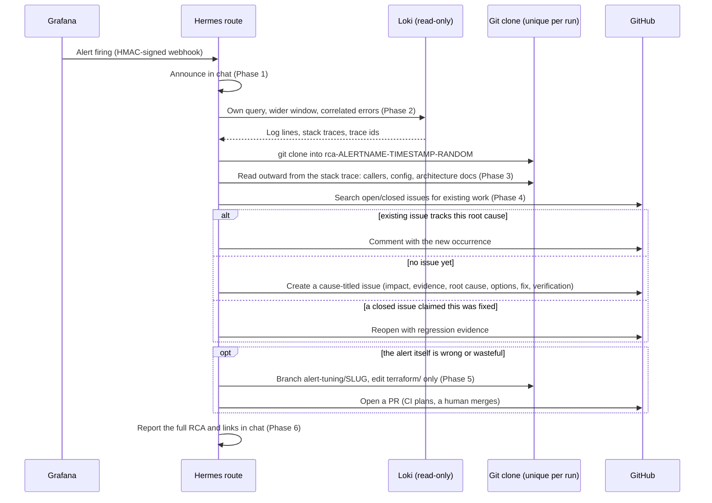

# Recipe: Grafana alert root-cause analysis

A Hermes webhook route that fires on a firing Grafana alert and does root-cause analysis —
gathers log evidence, reads the application code and its history, maintains a GitHub issue
trail (comment on existing work, open a new cause-titled issue, or reopen a regression), and
may propose an alert-tuning pull request if the alert itself was wrong. It is explicitly told
not to just apply a symptom patch.

Includes a Terraform module (`terraform/`) that manages the alert rules, notification policy,
and webhook contact point as code — so tuning a threshold or exclusion is a reviewable PR, not
a UI click that the next `terraform apply` silently reverts.

## How it investigates



## Prerequisites

- A running Hermes gateway (see `../../provisioning/`), reachable from your Grafana instance.
- A Grafana Cloud stack or self-hosted Grafana with Loki as a datasource, and a service
  account with **Editor or Admin** role for Terraform, plus a **separate, Viewer-only**
  service account for the read-only Loki queries the agent runs during investigation — see
  `docs/security-model.md` for why these must not be the same token.
- Structured (ideally OpenTelemetry) logs from your application reaching Loki with, at
  minimum, a `service_name` label and a way to identify error-level records
  (`detected_level="error"` in the examples here). The richer the structured metadata
  (`error_type`, `code_file_path`, `trace_id`, ...), the better the agent's evidence.
- A GitHub repo the agent can clone, search issues in, and open PRs against — with a
  Terraform-managed directory it's allowed to touch for tuning PRs (`terraform/grafana/` by
  convention; any path works, just keep the prompt and the module in agreement).

## Setup

### 1. Apply the Terraform module

```bash
cd terraform
cp terraform.tfvars.example terraform.tfvars   # fill in your values
cp backend.tf.example backend.tf               # or delete this if local state is fine for now
export GRAFANA_AUTH=glsa_...                    # Editor/Admin service-account token
export TF_VAR_hermes_route_secret=$(openssl rand -hex 32)
tofu init
tofu plan
tofu apply
```

This creates a folder, three example alert rules (adapt these — see the comments in
`rules.tf`), a notification policy, and an HMAC-signed webhook contact point pointing at your
Hermes gateway.

### 2. Mint a read-only Loki token for Hermes

In Grafana: Administration → Service accounts → new account, role **Viewer**, add a token.
On the gateway box:

```bash
mkdir -p ~/services/grafana && chmod 700 ~/services/grafana
cat > ~/services/grafana/grafana.env <<'EOF'
GRAFANA_URL=https://<your-stack>.grafana.net
GRAFANA_LOKI_TOKEN=<the viewer token>
EOF
chmod 600 ~/services/grafana/grafana.env
cp ../../scripts/loki-query.sh ../../scripts/loki-format.py ~/services/grafana/
chmod 755 ~/services/grafana/loki-query.sh ~/services/grafana/loki-format.py
```

### 3. Configure the Hermes route

```bash
export GITHUB_REPO=<your-org>/<your-repo>
export DISCORD_CHANNEL=<your-discord-channel>
export TERRAFORM_ALERTING_DIR=terraform/grafana   # must match where you applied the module, relative to repo root
HERMES_GRAFANA_ROUTE_SECRET=<the same secret from step 1> python3 configure-route.py
sudo systemctl restart hermes-gateway
```

### 4. Prove it end to end before trusting real alerts

Add a temporary rule to `terraform/rules.tf` with a trivial always-true query (e.g. a
Prometheus `vector(1)` expression if you have Prometheus, or a Loki query you know matches)
and the label `hermes_triage = "true"`, apply, watch the delivery arrive at your gateway, then
remove it. Confirm you see the chat announcement and, eventually, an issue or comment.

## Tuning

- **Noise exclusions.** The example rules include placeholder exclusion patterns
  (`known benign pattern here`, `favicon.ico`) — replace these with your own expected/benign
  error signatures. Getting this wrong in either direction (too broad, hiding real errors; too
  narrow, paging on noise) is the single biggest lever on whether this pipeline earns trust.
- **The `[no value]` templating trap.** If you add a rule that groups or annotates on a label
  that might be absent on some alert instances, guard it with `{{ if $labels.x }}...{{ end }}`
  the way `rules.tf` does for `error_type` — see `docs/lessons-learned.md` for what happens if
  you don't.
- **Alert-tuning PR path.** The route prompt restricts the agent to editing files under
  `TERRAFORM_ALERTING_DIR` and running `tofu fmt`/`tofu validate` before committing. Wire your
  own CI to plan on PRs touching that directory and apply on merge — this repo doesn't include
  that workflow since it depends on your CI system, but the shape is: plan + comment on PR,
  apply only after human merge, using a **separate** Terraform-scoped service account token
  from the one Hermes uses for reading logs.

## Anti-loop note

The durable SDLC receiver ignores new issues labelled `auto-triaged`. A configured human
may apply `ready-to-fix` to start planning, then separately approve the specification hash.
This installer no longer mutates another recipe's filters, so installation order cannot
disable the deliberate handoff. See [lifecycle operations](../../docs/ai-sdlc/operations.md).
