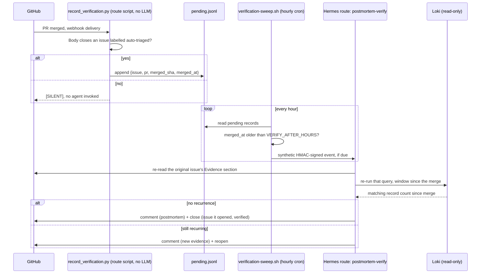

# Recipe: postmortem + verification

Closes the loop the other RCA recipes leave open: when a PR that closes an `auto-triaged`
issue merges, this recipe waits for the fix to actually be deployed, re-runs the original
evidence query, and either confirms the fix worked (and closes the issue with a short
postmortem) or reopens it with new evidence. No other tool researched for this project ties
postmortem generation to its own investigation trace via the medium you already have open —
a GitHub issue — most either skip it or draft it from a Slack transcript in a separate system.

## Why two routes and a cron job, not one webhook

A PR merging does not mean the fix is live. Hermes is a webhook gateway with no built-in
scheduler, so "wait a day, then check" needs an OS-level clock, not another webhook delivery.
This recipe splits the work accordingly:



The record step costs nothing (no LLM call — a Python script decides, in milliseconds, whether
this delivery is worth remembering at all). The verify step, the expensive one, only runs once
per merged fix, once, after a real deploy window has elapsed.

## Prerequisites

- `recipes/grafana-alert-rca` or `recipes/ci-failure-triage` already running, so there are
  `auto-triaged` issues with an Evidence section (a Loki query) worth re-verifying.
- The Loki query helper installed (`../../scripts/loki-query.sh`), same as those recipes.
- `flock` available on the gateway box (standard on Debian/Ubuntu via `util-linux`; not present
  on macOS by default — this recipe is written for a Linux gateway box).
- A GitHub webhook already delivering to this gateway with the `pull_request` event added.

## Setup

1. Generate two secrets (one per route — never reuse a secret across routes):
   ```bash
   export HERMES_POSTMORTEM_RECORD_SECRET=$(openssl rand -hex 32)
   export HERMES_POSTMORTEM_VERIFY_SECRET=$(openssl rand -hex 32)
   ```
2. On the gateway box:
   ```bash
   export GITHUB_REPO=<your-org>/<your-repo>
   export DISCORD_CHANNEL=<your-discord-channel>
   export VERIFY_AFTER_HOURS=20   # tune to your own deploy cadence
   python3 configure-route.py
   sudo systemctl restart hermes-gateway
   ```
   This writes `~/.hermes/scripts/record_verification.py`, `~/services/postmortem/verification-sweep.sh`
   (both fully templated, nothing left to fill in by hand), and the two routes in
   `~/.hermes/config.yaml`.
3. Install the cron job (hourly; the sweep script is a no-op if nothing is due):
   ```bash
   (crontab -l 2>/dev/null; echo "7 * * * * ~/services/postmortem/verification-sweep.sh") | crontab -
   ```
4. On GitHub: repo Settings → Webhooks → Add webhook, its own subscription pointed at
   `/webhooks/postmortem-record` with the `RECORD` secret from step 1, event `pull_request`
   only. Hermes dispatches by URL path, so this needs its own webhook even alongside
   `../github-issue-triage/`'s or `../ci-failure-triage/`'s on the same repo.
5. Test the record step directly, without waiting for a real merge:
   ```bash
   echo '{"action":"closed","pull_request":{"number":1,"merged":true,"merge_commit_sha":"abc123","body":"Closes #<a real auto-triaged issue number>"}}' \
     | python3 ~/.hermes/scripts/record_verification.py
   cat ~/services/postmortem/pending.jsonl
   ```
6. To test the verify step without waiting `VERIFY_AFTER_HOURS`, edit that one pending record's
   `merged_at` to something far enough in the past, then run
   `~/services/postmortem/verification-sweep.sh` by hand and watch `sweep.log` and your chat
   channel.

## Tuning

- **`VERIFY_AFTER_HOURS`.** Set this to comfortably longer than your normal deploy pipeline
  takes from merge to live. Too short and you verify against a version that hasn't shipped
  yet; too long and postmortems lag further behind the incident than they need to.
- **Evidence-query extraction is best-effort.** PHASE 1 of the verify prompt searches the
  original issue body for a Loki query. This works reliably when the RCA that created the
  issue used the standard Evidence-section template from `../grafana-alert-rca` or
  `../ci-failure-triage`; a hand-written issue without a fenced query block will make the
  agent report "no evidence query found" rather than guess.
- **Closing its own issues.** This is the one recipe allowed to close an issue — and only one
  it opened itself, and only after a positive re-verification. Every other write boundary in
  this repo stays as documented in `../../docs/security-model.md`.
